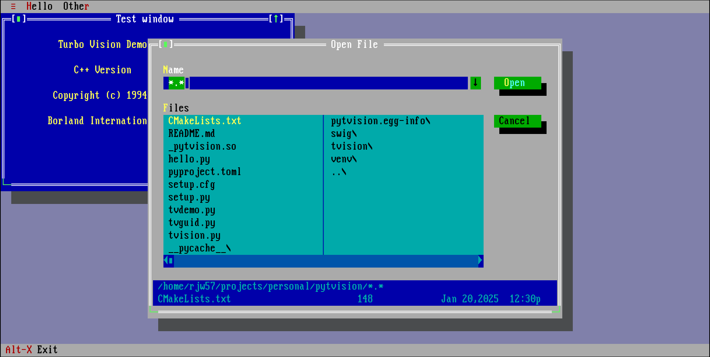

# Python bindings for tvision

Experimental bindings for Python for the tvision TUI library.



## Building

```console
$ cmake -B ./build -DCMAKE_BUILD_TYPE=Release .
$ cmake --build ./build --parallel
$ PYTHONPATH=./build/swig python tvdemo.py
```

If all dependencies are in place, this repo should be `pip install`-able.

## Wheels

Build "manylinux-tagged" wheels via:

```console
$ docker run --rm -it -v $PWD:/work -w /work quay.io/pypa/manylinux_2_28_x86_64
# yum install cmake gpm-devel ncurses-devel
# for PYBIN in /opt/python/*/bin; do rm -rf build; "${PYBIN}/pip" wheel  . --no-deps -w wheelhouse/; done
# auditwheel repair wheelhouse/*.whl
```
